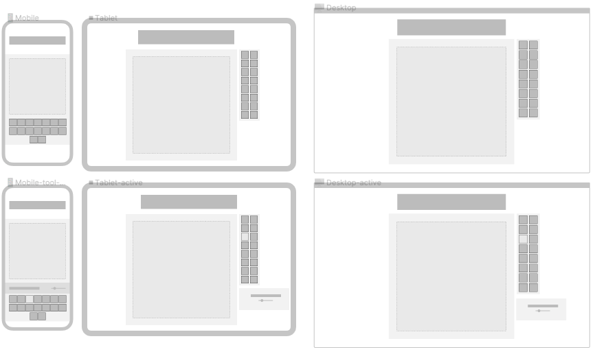

# Table of contents

 **_UX:_**
 - Project Goals
- User Goals
- User Stories
- Site Owner Goals
- User Requirements and Expectations
 
**_Design Choices:_**
- Fonts
- Icons
- Colours

**_Technologies:_**
- HTML
- CSS
- JavaScript

 **_Features:_**
- Features that have been developed
- Features that will be implemented in the future

**_Deployment:_**

**_Credit:_**

---
## UX (User Experience) ##
---
### Project Goals ### 
The goal of this project is to enable everyone to create and share their own [Memes](https://simple.wikipedia.org/wiki/Meme) via an easy to use editor. 

### User Goals ###
Easily create a meme and download it
1. upload 1 or more images and/or load 1 or more images the template selection
2. add and format text
3. add freehand drawing
4. add graphic shapes square/circle
5. add/change colour on shapes/text/freehand drawing
6. rearrange top/bottom position of content  
7. delete content 
8. download final meme creation


### User Stories ###
- As a user, I do not have photoshop or something similar but I want to create a meme.
- As a user, I want an easy to use and understand UI.
- As a user, I want to be able to create on my desktop, laptop or mobile device.
- As a user, I want to be able to share or save my creation.

### Site Owner Goals ###
- As a site owner, I want users to enjoy the fun of memes.
- As a site owner, I want users to easily create memes.


### User Requirements and Expectations ###

**Requirements**

- Easy to navigate the app UI via the icons in the navigation.
- No fuzz creating a meme and share it.


**Expectations**
- Button icons are explanatory enough for users to understand what their function is.

## Design Choices ##
---
- I used Anton from google fonts, as it is a free font and the one with the closets resemblance to Impact (the original meme font) I could find
- For icons I used font-awesome
- I kept the colour scheme dark with a single light blue to make it pop


## Wireframes ##
---
I used [Figma](https://www.figma.com/). To produced **lo-fi** wireframes.


## Technologies ##
---
The site is built with HTML, CSS and javaScript / Node.js.
In Development, I used VS-code as my editor and  [Vite](https://vitejs.dev/ "Vite's Homepage") as my Development server.

_library:_
For ease of use, I went with [Fabricjs](http://fabricjs.com/ "fabricjs Homepage") so I did not have to fight the HTML5 canvas API and write a ton of unreadable code.


##  Features ##
--- 
- Features that have been developed
    - Add text to canvas
    - Freehand drawing
    - Add shapes (rect and circle)
    - Change colour of shapes, lines and text
    - Move object "layers" up or down
    - Upload image from a device
    - Download image to Device

- Features that will be implemented in the future
    - Change the font type
    - Share image on social networks
    - Easier scale rotation of objects

## Deployment ##
---
The [site](https://thememeinator.vercel.app/) is deployet to [Vercel ](https://vercel.com/ "vercel's Homepage"). 

​​Vercel allows for automatic deployments on every branch push and merges onto the Production Branch of your GitHub projects.

Follow this [guide](https://vercel.com/docs/git#deploying-a-git-repository) if you want to learn how you can do it.

### To run locally: ###
Log in to GitHub and click on the repository to download [ms2-memeinator](https://github.com/kristianAndersen/ms2-memeinator/archive/refs/heads/main.zip)
Select Code and click Download the ZIP file.
After download, you can extract the file.

Make shure you have [nodejs](https://nodejs.org/en/) installed. 

open a terminal and cd into ms2-memeinator directory and run ```npm install``` to install the needed node modules. 

When npm is finished installing run ```npm run dev``` to open a local development server.

## Credit ##
---
Thanks to Google/Stackoverflow for answering my questions.

Thanks to Evan You for creating [vitejs](https://vitejs.dev/) which enabled me to have a modern modular developer experience.

Thanks to [imgflip](https://imgflip.com/) for providing a free [API](https://imgflip.com/api) 

Thanks to Juriy Zaytsev for creating [fabricjs](http://fabricjs.com/), creating this project without would suck.

high5 to Muhammad Asif Javed for his [scaleToFit](https://stackoverflow.com/questions/36951856/resize-background-image-of-canvas-fabricjs/59975923#59975923*/) image code
kudos to Conor Murphy for his [drag toss scoll](https://codepen.io/cmurphy580/pen/WXEZrw?editors=0010) code 

